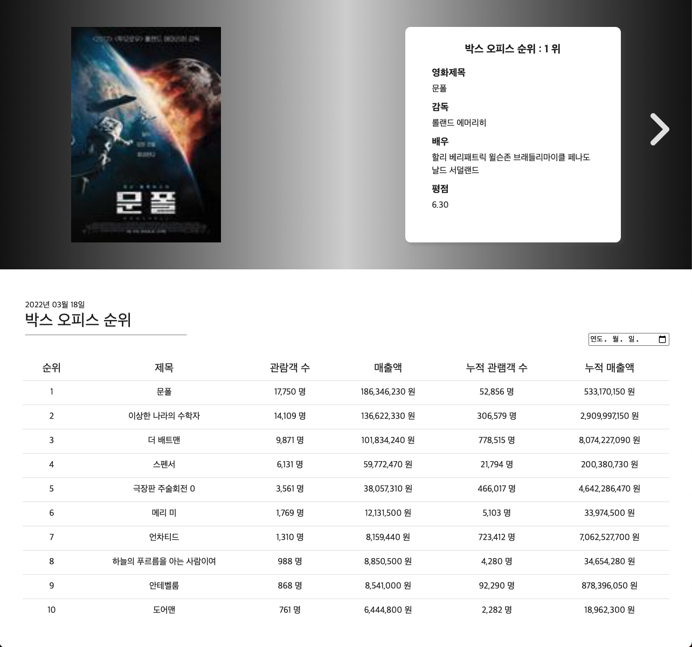
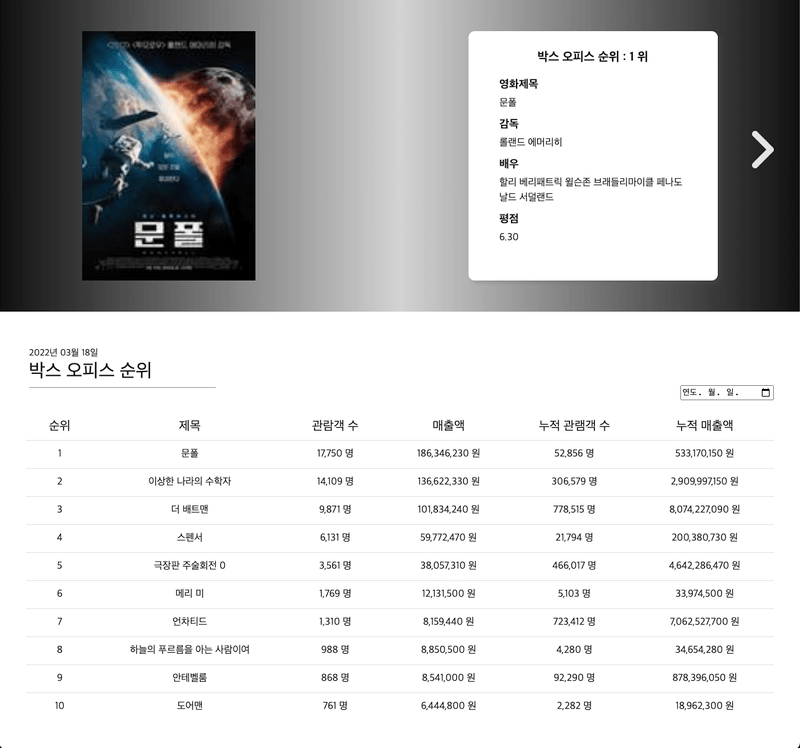

# MovieRanker

### 🚀 [실행](https://byeongminlee.github.io/MovieRanker/)

<br>

## 🛠 Stack

<div>
    
    
    
    
</div>

<br>

## 👋 소개

날짜별 영화 랭킹을 보여주는 사이트 입니다.<br>
영화진흥위원회에서 날짜별 박스오피스 TOP10을 가져옵니다. <br>
그리고 영화진흥위원회에서는 영화의 포스터 사진을 제공하지 않으므로 박스오피스 순위로 영화제목으로 네이버 영화 검색 API를 사용해서 영화에 대한 정보를 가져옵니다. <br>



<br>

|                                                             영화 개별 소개                                                             |                                                               날짜 변경                                                                |
| :------------------------------------------------------------------------------------------------------------------------------------: | :------------------------------------------------------------------------------------------------------------------------------------: |
| <p style='text-align:left'>날짜를 재 선택하면 영화진흥원에서 새로 데이터를 가져옵니다.</p><br> | <p style='text-align:left'>네이버 API를 사용함으로써 영화 평점과 포스터를 화면에 보여줍니다.</p><br> |

<br>

## ⚙️ 설치

1. 클론 받기

    ```sh
    $ git clone https://github.com/ByeongminLee/MovieRanker.git
    ```

2. openAPI KEY발급

    다음 두곳에서 API 발급<br>
    [영화진흥위원회](https://www.kobis.or.kr/kobisopenapi/homepg/main/main.do)<br>
    [네이버 개발자](https://developers.naver.com/)

3. <code>.env</code> 파일 생성

    <code>/</code>(root) 경로에 <code>.env</code>파일 생성후 다음과 같이 추가

    ```md
    REACT_APP_MOVIE_RANK_URL = "영화진흥원키"
    REACT_APP_NAVER_CLIENT_ID = "네이버 ID KEY"
    REACT_APP_NAVER_CLIENT_SECRET = "네이버 시크립 KEY"
    ```

<br>

## 📁 파일 구조

```md
src
├── App.js
├── Components
│ ├── Card.js
│ ├── Meta.js
│ ├── Slide.js
│ └── Tables.js
├── GlobalStyles.js
├── Pages
│ └── Main.js
├── imgs
│ └── noImg.png
├── index.js
├── slices
│ ├── MovieRankSlice.js
│ └── MovieSearchSlice.js
└── store.js
```
